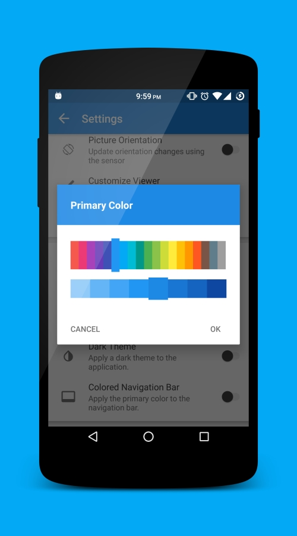
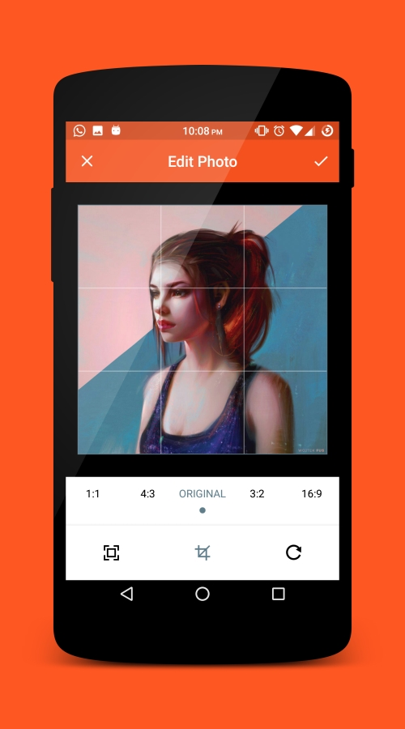

# LeafPic

LeafPic is a fluid, material-designed alternative gallery, it also is ad-free and open source under GPLv3 license. It doesn't miss any of the main features of a stock gallery, and we also have plans to add more useful features. 

  

## Screenshots

###### Issues
You can trace the status of known issues here,
also feel free to file a new issue (helpful description, screenshots and logcat are appreciated), or send me an [email](mailto:sjaiprakash457@gmail.com) if you have any questions.

#### Licensing
LeafPic is licensed under the [GNU v3 Public License](https://gitlab.com/HoraApps/LeafPic/blob/dev/LICENSE).
In addition to the terms set by the GNU v3 Public License, we ask that if you use any code from this repository that you send us a message to let us know.
